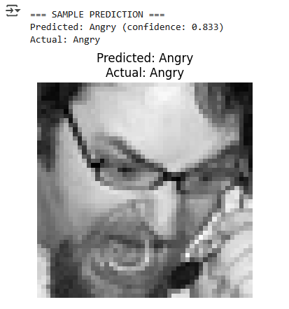

# Facial Emotion Detection using Deep Learning

This project is a real-time **Facial Emotion Detection** system built using **Deep Learning** and deployed through a simple and interactive **Streamlit web app**.

It detects and classifies human facial emotions into categories like:
- 😄 Happy
- 😢 Sad
- 😠 Angry
- 😮 Surprise
- 😐 Neutral
- 😲 Fear
- 🤢 Disgust


## 🚀 Demo




## 🧠 Model Info

The system is powered by a **Convolutional Neural Network (CNN)** trained on the [FER-2013](https://www.kaggle.com/datasets/msambare/fer2013) dataset, containing grayscale 48x48 pixel facial images labeled with 7 emotion classes.

The trained model is saved as:  
```

model/emotion\_model.h5

```


## 🧾 Features

- Real-time emotion prediction from face images
- Supports JPG, PNG, JPEG formats
- Uses OpenCV for face detection
- Simple & fast UI with Streamlit
- Easily extendable or deployable on cloud


## 📁 Project Structure

```

facial-emotion-detection/
├── app.py                       ← Streamlit app entrypoint
├── model/
│   └── emotion\_model.h5         ← Trained CNN model
├── src/
│   ├── detector.py              ← Face detection + emotion prediction logic
│   └── train.py                 ← (Optional) Model training script
├── screenshots/
│   └── demo.png                 ← Output example
├── requirements.txt             ← Python dependencies
├── README.md
└── .gitignore

````


## ⚙️ How to Run the App

### ▶️ 1. Clone the Repo
```bash
git clone https://github.com/mubashir-yaseen/facial-emotion-detection.git
cd facial-emotion-detection
````

### ▶️ 2. Install Requirements

```bash
pip install -r requirements.txt
```

### ▶️ 3. Run the Streamlit App

```bash
streamlit run app.py
```

Then open the URL in your browser (usually [http://localhost:8501](http://localhost:8501)).


## 📦 Requirements

* Python 3.7+
* Streamlit
* OpenCV
* TensorFlow / Keras
* NumPy
* Pillow

Install using:

```bash
pip install -r requirements.txt
```


## 📚 Dataset

Model trained on:
📦 [FER-2013 Emotion Dataset](https://www.kaggle.com/datasets/msambare/fer2013)


## 🙋‍♂️ Author

**Muhammad Mubashir**
🔗 [GitHub](https://github.com/mubashir-yaseen)


## 📄 License

This project is licensed under the MIT License.

```
